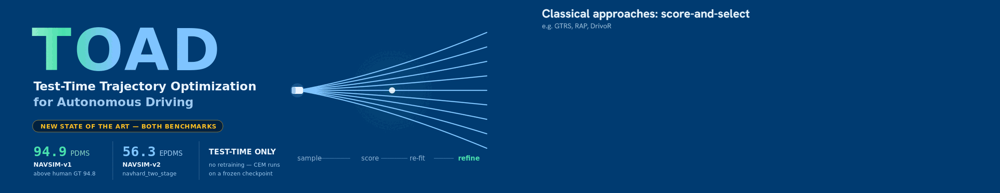
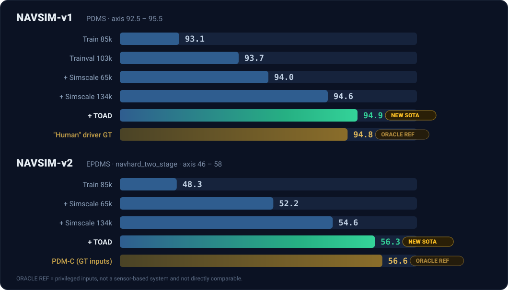

<div align="center">



<h3>Sampling-based test-time refinement that takes a <b>frozen</b> driving policy to<br>
<b>94.9&nbsp;PDMS</b> on NAVSIM-v1 and <b>56.3&nbsp;EPDMS</b> on NAVSIM-v2 — <b>state of the art on both</b>.</h3>

[](https://arxiv.org/abs/2606.07170)
[](https://valeoai.github.io/publications/TOAD/)
[](https://github.com/valeoai/DrivoR/releases/tag/Scaling)
[](https://www.python.org/)
[](https://pytorch.org/)

</div>

---

## Overview

TOAD refines a driving policy's trajectory **at inference time**: instead of committing to a single
forward pass, it samples trajectory proposals, scores them, and iteratively re-fits the sampling
distribution around the best ones with the cross-entropy method (CEM). The same trained checkpoint
therefore gets better simply by being optimized at test time.

See [Results](#results) for the full results.

## Contents

- [Installation](#installation)
- [Data and weights](#data-and-weights)
- [Environment setup](#environment-setup)
- [Evaluation](#evaluation)
- [Results](#results)
- [Submitting to the official server](#submitting-to-the-official-server)
- [Standalone implementation](#standalone-implementation)
- [Citation](#citation)
- [Acknowledgements](#acknowledgements)

## Installation

```bash
conda create -n drivoR python=3.9
conda activate drivoR
pip install torch==2.1.0 torchvision==0.16.0 torchaudio==2.1.0 --index-url https://download.pytorch.org/whl/cu121
pip install -e ./nuplan-devkit
pip install -e .
```

## Data and weights

**1. NAVSIM data.** Download the splits and organise them exactly as described in the
[NAVSIM install guide](https://github.com/autonomousvision/navsim/blob/main/docs/install.md)
(a local copy lives in [`docs/install.md`](docs/install.md)).

```bash
bash ./download/download_navtrain_hf.sh        # or download_navtrain_aws.sh
bash ./download/download_navhard_two_stage.sh
bash ./download/download_warmup_two_stage.sh
```

**2. DINOv2 backbone.** Grab every file from
[`timm/vit_small_patch14_reg4_dinov2.lvd142m`](https://huggingface.co/timm/vit_small_patch14_reg4_dinov2.lvd142m/tree/main)
and place them in `./weights/vit_small_patch14_reg4_dinov2.lvd142m/`.

**3. Checkpoints.** Download into `./weights/`. The main DrivoR NAVSIM-v1 checkpoint (EPDMS 54.6, train 103k + simscale 134k, 30 epochs, with random_bouquets):

<details>
<summary>training script with 64 random bouquets </summary>

```
export HYDRA_FULL_ERROR=1 \
EXPERIMENT=drivoR_WITH_RAY_Nav1_simscale_Proposals_Aug
AGENT=drivoR_speed_up
python $NAVSIM_DEVKIT_ROOT/navsim/planning/script/run_training_full_simscale.py  \
    agent=$AGENT \
    experiment_name=$EXPERIMENT \
    train_test_split=navtrain \
    cache_path=null \
    use_cache_without_dataset=false \
    trainer.params.max_epochs=30 \
    dataloader.params.prefetch_factor=1 \
    dataloader.params.batch_size=16 \
    agent.lr_args.name=AdamW \
    agent.lr_args.base_lr=0.0002 \
    agent.num_gpus=8 \
    agent.progress_bar=false \
    agent.config.refiner_ls_values=0.0 \
    agent.config.image_backbone.focus_front_cam=false \
    agent.config.one_token_per_traj=true \
    agent.config.refiner_num_heads=1 \
    agent.config.tf_d_model=256 \
    agent.config.tf_d_ffn=1024 \
    agent.config.area_pred=false \
    agent.config.agent_pred=false \
    agent.config.ref_num=4 \
    agent.loss.prev_weight=0.0 \
    agent.config.long_trajectory_additional_poses=2\
    agent.config.proposal_augment_random=64 \
    seed=2
```
</details>


```bash
mkdir -p ./weights
wget -P ./weights \
  https://github.com/valeoai/TOAD/releases/download/Nav1/nav1_30epochs_with_134k_simscale_103ktrainval_random_bouquet.pth
```

<details>
<summary>Expected layout</summary>

```
TOAD/
├── dataset/
│   ├── maps/
│   ├── navhard_two_stage/
│   └── ...
└── weights/
    ├── vit_small_patch14_reg4_dinov2.lvd142m/
    └── nav1_30epochs_with_134k_simscale_103ktrainval_random_bouquet.pth
```

</details>

## Environment setup

Run this once per shell before evaluating (adjust the module versions to your cluster):

```bash
cd drivoR
conda activate drivoR

module load Ninja/1.11.1-GCCcore-12.2.0
module load CUDA/12.2.0
module load cuDNN/8.9.2.26-CUDA-12.2.0
module load GCC/12.2.0

export NUPLAN_MAP_VERSION="nuplan-maps-v1.0"
export NUPLAN_MAPS_ROOT="/PATH/TO/drivoR/dataset/maps"
export NAVSIM_EXP_ROOT="/PATH/TO/drivoR/exp"
export NAVSIM_DEVKIT_ROOT="/PATH/TO/drivoR/"
export OPENSCENE_DATA_ROOT="/PATH/TO/drivoR/dataset"
```


## Evaluation
The evaluation was ran under 8XA100 GPUs with fixed seed=2, the results may vary with reduced GPUs and a different seed (with mean±std around Nav1: 94.8 ± 0.08 PDMS, 56.2 ± 0.15 EPMDS). We report better results on Nav1 than the paper (94.7) due to the use of random bouquet that auguments the proposals and trains a better scorer.

First, cache the metrics used for the PDM score:

```bash
bash scripts/evaluation/run_metric_caching.sh
```

Then run TOAD on **NAVSIM-v1** (`navtest`). `cem_iteration` and `cem_samples` are the two
test-time compute knobs — raising them trades latency for score.


<details open>
<summary><b>NAVSIM-v1 evaluation command</b></summary>

```bash
cem_samples=64
cem_iteration=10
experiment_name="TOAD_drivoR_nav1" 
export SUBSCORE_PATH=$NAVSIM_EXP_ROOT
python $NAVSIM_DEVKIT_ROOT/navsim/planning/script/run_pdm_score_multi_gpu.py \
        train_test_split=navtest \
        agent=drivoR \
        agent.checkpoint_path=$NAVSIM_DEVKIT_ROOT/weights/nav1_30epochs_with_134k_simscale_103ktrainval_random_bouquet.pth \
        experiment_name=${experiment_name} \
    	agent.config.proposal_num=64 \
        agent.config.refiner_ls_values=0.0 \
        agent.config.image_backbone.focus_front_cam=false \
        agent.config.one_token_per_traj=true \
        agent.config.refiner_num_heads=1 \
        agent.config.tf_d_model=256 \
        agent.config.tf_d_ffn=1024 \
        agent.config.area_pred=false \
        agent.config.agent_pred=false \
        agent.config.ref_num=4 \
    	agent.config.noc=1 \
    	agent.config.dac=1\
    	agent.config.ddc=0.0 \
    	agent.config.ttc=5 \
    	agent.config.ep=5 \
    	agent.config.comfort=2 \
    	agent.config.use_cem=true \
    	agent.config.cem_seed_topk=${cem_samples} \
    	agent.config.cem_num_samples=${cem_samples} \
	    agent.config.proposal_augment_random=64 \
    	agent.config.cem_num_iterations=${cem_iteration}
```

</details>

## Results

> [!IMPORTANT]
> **TOAD sets a new state of the art on both NAVSIM benchmarks — 94.9 PDMS on
> NAVSIM-v1 and 56.3 EPDMS on NAVSIM-v2 (`navhard_two_stage`) — with no
> retraining.** Both numbers come from running CEM at test time on top of the
> same frozen checkpoint that scores 94.6 / 54.6 on its own.

<div align="center">

</div>

| Benchmark | Metric | Frozen checkpoint | **+ TOAD** | Δ |
| :--- | :---: | ---: | ---: | ---: |
| **NAVSIM-v1** | PDMS | 94.6 | 🏆 **94.9** | **+0.3** |
| **NAVSIM-v2** | EPDMS | 54.6 | 🏆 **56.3** | **+1.7** |

On NAVSIM-v1, 94.9 PDMS lands **above the "human" driver ground truth (94.8)** —
TOAD scores higher than the logged human trajectory the policy was trained to
imitate. On NAVSIM-v2, 56.3 EPDMS comes within **0.3 of PDM-C given privileged
ground-truth perception inputs (56.6)**: test-time search closes most of the gap
to a planner that is handed the scene rather than having to infer it. Note
that PDM-C (GT inputs) is an oracle reference, not a comparable system — it does
not run from sensor input.


## Submitting to the official server

Generate `submission.pkl` for the NAVTEST leaderboard, then upload it to
[AGC2024-P/e2e-driving-navtest](https://huggingface.co/spaces/AGC2024-P/e2e-driving-navtest).

<details>
<summary><b>Submission command</b></summary>

```bash
TEAM_NAME=" "
AUTHORS=""
EMAIL="xxx@xxx"
INSTITUTION=""
COUNTRY=""

TRAIN_TEST_SPLIT=navtest
export SUBSCORE_PATH=$NAVSIM_EXP_ROOT
EXPERIMENT=drivoR_nav1
cem_samples=64
cem_iteration=10
AGENT=drivoR
python $NAVSIM_DEVKIT_ROOT/navsim/planning/script/run_create_submission_pickle_warmup_gpu.py \
        train_test_split=navtest \
        agent=drivoR \
        agent.checkpoint_path=$NAVSIM_DEVKIT_ROOT/weights/nav1_30epochs_with_134k_simscale_103ktrainval_random_bouquet.pth \
        experiment_name=${experiment_name} \
        agent.config.proposal_num=64 \
        agent.config.refiner_ls_values=0.0 \
        agent.config.image_backbone.focus_front_cam=false \
        agent.config.one_token_per_traj=true \
        agent.config.refiner_num_heads=1 \
        agent.config.tf_d_model=256 \
        agent.config.tf_d_ffn=1024 \
        agent.config.area_pred=false \
        agent.config.agent_pred=false \
        agent.config.ref_num=4 \
        agent.config.noc=1 \
        agent.config.dac=1\
        agent.config.ddc=0.0 \
        agent.config.ttc=5 \
        agent.config.ep=5 \
        agent.config.comfort=2 \
        agent.config.use_cem=true \
	    agent.config.cem_seed_topk=${cem_samples} \
	    agent.config.cem_num_samples=${cem_samples} \
        agent.config.cem_num_iterations=${cem_iteration} \
        agent.config.proposal_augment_random=64 \
 	    +seed=2 \
        +agent.config.cem_num_elites=8

```

</details>

## Standalone implementation

[`drivor_cem_portable/`](drivor_cem_portable) applies TOAD to **any set of trajectory proposals** —
they do not have to come from DrivoR, or from a NAVSIM agent at all. Hand it proposals from your own
planner and it runs the same test-time CEM optimization, using DrivoR as the scorer, and returns a
refined trajectory.

The bundle is self-contained — the minimal `navsim` source subset, the DrivoR config, the DrivoR
checkpoint and the DINOv2 backbone weights — with **no NAVSIM, `nuplan` or `hydra` dependency**. It
resolves all paths relative to its own location, so it runs from any working directory.

```bash
cd drivor_cem_portable
pip install -r requirements.txt
python -m navsim.agents.utils.drivor_cem_standalone   # toy example
```

Plugging your own proposals in:

```python
from navsim.agents.utils import drivor_cem_standalone as dcs

model = dcs.load_drivor()                 # bundled config/ckpt/overrides, seed=2
out = dcs.cem_refine_with_drivor(
    model,
    features,                             # drivor_image + drivor_ego_status
    proposals=proposals,                  # (B, N_p, P, 3) — your planner's proposals
    best_traj=best_traj,                  # (B, P, 3) — your anchor / argmax pick
)
refined = out["trajectory"]               # (B, P, 3)
```

Proposals are `(x, y, heading)` poses in the local rear-axle frame. DrivoR expects `P = 8` poses at
0.5 s intervals; denser trajectories can be passed through with `subsample_indices`. See
[`drivor_cem_portable/README.md`](drivor_cem_portable/README.md) for the full input specification
(camera order, normalization, ego-status layout) and the CEM defaults.

## Citation

If TOAD is useful for your research, please cite:

```bibtex
@misc{xu2026toad,
  title         = {Test-Time Trajectory Optimization for Autonomous Driving},
  author        = {Xu, Yihong and Zablocki, {\'E}loi and Yin, Yuan and Ramzi, Elias and Kirby, Ellington and Boulch, Alexandre and Cord, Matthieu},
  year          = {2026},
  eprint        = {2606.07170},
  archivePrefix = {arXiv},
  primaryClass  = {cs.CV}
}
```

## Acknowledgements
This code takes inspiration from [DrivoR](https://github.com/valeoai/DrivoR).